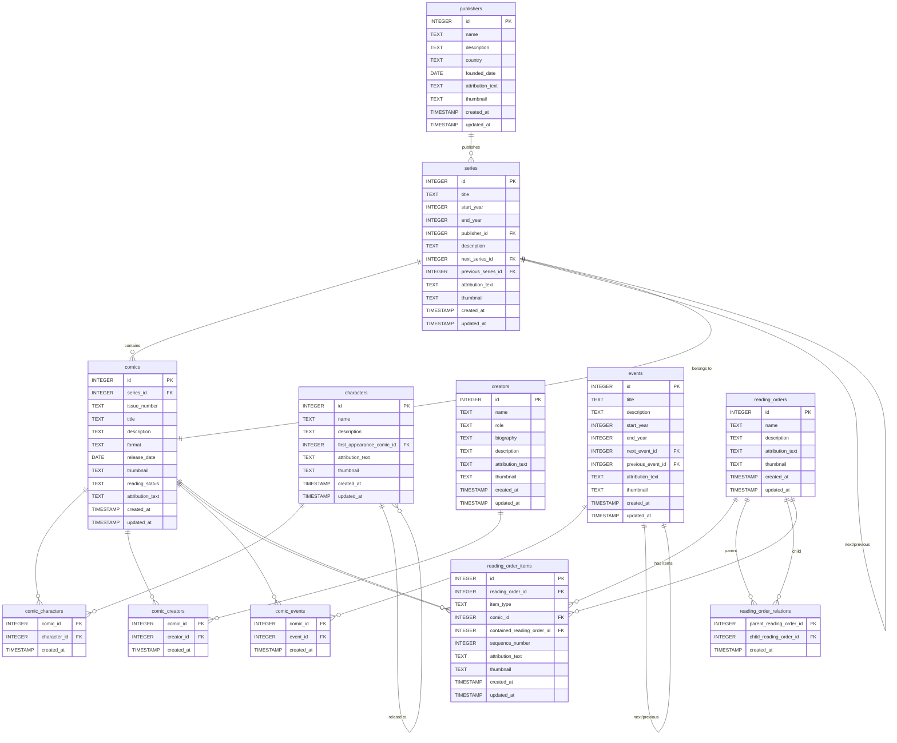

# Database Schema Design

This document outlines the database schema for the **Comic Book Manager** application. The schema defines all entities, their fields, data types, constraints, and relationships, providing a comprehensive blueprint for implementing the database.

---

## Table of Contents

- [Database Schema Design](#database-schema-design)
  - [Table of Contents](#table-of-contents)
  - [1. Publishers](#1-publishers)
  - [2. Series](#2-series)
  - [3. Comics](#3-comics)
  - [4. Characters](#4-characters)
  - [5. Creators](#5-creators)
  - [6. Events](#6-events)
  - [7. Reading Orders](#7-reading-orders)
  - [8. Reading Order Items](#8-reading-order-items)
  - [9. Associations](#9-associations)
    - [9.1. Comic-Character Association](#91-comic-character-association)
    - [9.2. Comic-Creator Association](#92-comic-creator-association)
    - [9.3. Comic-Event Association](#93-comic-event-association)
    - [9.4. Reading Order Relations](#94-reading-order-relations)
  - [10. Application-Level Auditing Tables](#10-application-level-auditing-tables)
    - [Example: Publishers Audit Table](#example-publishers-audit-table)
  - [11. Notes and Explanations](#11-notes-and-explanations)
    - [11.1. Attribution Text and Thumbnail Fields](#111-attribution-text-and-thumbnail-fields)
    - [11.2. Self-Referential Relationships](#112-self-referential-relationships)
    - [11.3. Reading Orders and Nested Reading Orders](#113-reading-orders-and-nested-reading-orders)
    - [11.4. Constraints and Data Integrity](#114-constraints-and-data-integrity)
    - [11.5. Data Integrity and Cycle Prevention](#115-data-integrity-and-cycle-prevention)
  - [12. Diagram](#12-diagram)

---

## 1. Publishers

**Table Name:** `publishers`

**Fields:**

- `id` (INTEGER, PRIMARY KEY, AUTOINCREMENT)
- `name` (TEXT, NOT NULL, UNIQUE)
- `description` (TEXT)
- `country` (TEXT)
- `founded_date` (DATE)
- `attribution_text` (TEXT)
- `thumbnail` (TEXT)
- `created_at` (TIMESTAMP, DEFAULT CURRENT_TIMESTAMP)
- `updated_at` (TIMESTAMP, DEFAULT CURRENT_TIMESTAMP)

---

## 2. Series

**Table Name:** `series`

**Fields:**

- `id` (INTEGER, PRIMARY KEY, AUTOINCREMENT)
- `title` (TEXT, NOT NULL)
- `start_year` (INTEGER)
- `end_year` (INTEGER)
- `publisher_id` (INTEGER, FOREIGN KEY to `publishers(id)`)
- `description` (TEXT)
- `next_series_id` (INTEGER, FOREIGN KEY to `series(id)`)
- `previous_series_id` (INTEGER, FOREIGN KEY to `series(id)`)
- `attribution_text` (TEXT)
- `thumbnail` (TEXT)
- `created_at` (TIMESTAMP, DEFAULT CURRENT_TIMESTAMP)
- `updated_at` (TIMESTAMP, DEFAULT CURRENT_TIMESTAMP)

**Constraints:**

- Unique constraint on (`title`, `start_year`).

---

## 3. Comics

**Table Name:** `comics`

**Fields:**

- `id` (INTEGER, PRIMARY KEY, AUTOINCREMENT)
- `series_id` (INTEGER, FOREIGN KEY to `series(id)`, NOT NULL)
- `issue_number` (TEXT, NOT NULL)
- `title` (TEXT)
- `description` (TEXT)
- `format` (TEXT)
- `release_date` (DATE)
- `thumbnail` (TEXT)
- `reading_status` (TEXT, CHECK (reading_status IN ('Read', 'Unread')))
- `attribution_text` (TEXT)
- `created_at` (TIMESTAMP, DEFAULT CURRENT_TIMESTAMP)
- `updated_at` (TIMESTAMP, DEFAULT CURRENT_TIMESTAMP)

**Constraints:**

- Unique constraint on (`series_id`, `issue_number`).

---

## 4. Characters

**Table Name:** `characters`

**Fields:**

- `id` (INTEGER, PRIMARY KEY, AUTOINCREMENT)
- `name` (TEXT, NOT NULL, UNIQUE)
- `description` (TEXT)
- `first_appearance_comic_id` (INTEGER, FOREIGN KEY to `comics(id)`)
- `attribution_text` (TEXT)
- `thumbnail` (TEXT)
- `created_at` (TIMESTAMP, DEFAULT CURRENT_TIMESTAMP)
- `updated_at` (TIMESTAMP, DEFAULT CURRENT_TIMESTAMP)

---

## 5. Creators

**Table Name:** `creators`

**Fields:**

- `id` (INTEGER, PRIMARY KEY, AUTOINCREMENT)
- `name` (TEXT, NOT NULL, UNIQUE)
- `role` (TEXT)
- `biography` (TEXT)
- `description` (TEXT)
- `attribution_text` (TEXT)
- `thumbnail` (TEXT)
- `created_at` (TIMESTAMP, DEFAULT CURRENT_TIMESTAMP)
- `updated_at` (TIMESTAMP, DEFAULT CURRENT_TIMESTAMP)

---

## 6. Events

**Table Name:** `events`

**Fields:**

- `id` (INTEGER, PRIMARY KEY, AUTOINCREMENT)
- `title` (TEXT, NOT NULL)
- `description` (TEXT)
- `start_year` (INTEGER)
- `end_year` (INTEGER)
- `next_event_id` (INTEGER, FOREIGN KEY to `events(id)`)
- `previous_event_id` (INTEGER, FOREIGN KEY to `events(id)`)
- `attribution_text` (TEXT)
- `thumbnail` (TEXT)
- `created_at` (TIMESTAMP, DEFAULT CURRENT_TIMESTAMP)
- `updated_at` (TIMESTAMP, DEFAULT CURRENT_TIMESTAMP)

**Constraints:**

- Unique constraint on (`title`, `start_year`).

---

## 7. Reading Orders

**Table Name:** `reading_orders`

**Fields:**

- `id` (INTEGER, PRIMARY KEY, AUTOINCREMENT)
- `name` (TEXT, NOT NULL, UNIQUE)
- `description` (TEXT)
- `attribution_text` (TEXT)
- `thumbnail` (TEXT)
- `created_at` (TIMESTAMP, DEFAULT CURRENT_TIMESTAMP)
- `updated_at` (TIMESTAMP, DEFAULT CURRENT_TIMESTAMP)

---

## 8. Reading Order Items

**Table Name:** `reading_order_items`

**Fields:**

- `id` (INTEGER, PRIMARY KEY, AUTOINCREMENT)
- `reading_order_id` (INTEGER, FOREIGN KEY to `reading_orders(id)`, NOT NULL)
- `item_type` (TEXT, NOT NULL, CHECK (item_type IN ('comic', 'reading_order')))
- `comic_id` (INTEGER, FOREIGN KEY to `comics(id)`)
- `contained_reading_order_id` (INTEGER, FOREIGN KEY to `reading_orders(id)`)
- `sequence_number` (INTEGER, NOT NULL)
- `attribution_text` (TEXT)
- `thumbnail` (TEXT)
- `created_at` (TIMESTAMP, DEFAULT CURRENT_TIMESTAMP)
- `updated_at` (TIMESTAMP, DEFAULT CURRENT_TIMESTAMP)

**Constraints:**

- Unique constraint on (`reading_order_id`, `sequence_number`).
- Check constraint to ensure that:
  - If `item_type` is 'comic', `comic_id` is NOT NULL and `contained_reading_order_id` is NULL.
  - If `item_type` is 'reading_order', `contained_reading_order_id` is NOT NULL and `comic_id` is NULL.

---

## 9. Associations

### 9.1. Comic-Character Association

**Table Name:** `comic_characters`

**Fields:**

- `comic_id` (INTEGER, FOREIGN KEY to `comics(id)`, NOT NULL)
- `character_id` (INTEGER, FOREIGN KEY to `characters(id)`, NOT NULL)
- `created_at` (TIMESTAMP, DEFAULT CURRENT_TIMESTAMP)

**Constraints:**

- Primary key on (`comic_id`, `character_id`).

---

### 9.2. Comic-Creator Association

**Table Name:** `comic_creators`

**Fields:**

- `comic_id` (INTEGER, FOREIGN KEY to `comics(id)`, NOT NULL)
- `creator_id` (INTEGER, FOREIGN KEY to `creators(id)`, NOT NULL)
- `created_at` (TIMESTAMP, DEFAULT CURRENT_TIMESTAMP)

**Constraints:**

- Primary key on (`comic_id`, `creator_id`).

---

### 9.3. Comic-Event Association

**Table Name:** `comic_events`

**Fields:**

- `comic_id` (INTEGER, FOREIGN KEY to `comics(id)`, NOT NULL)
- `event_id` (INTEGER, FOREIGN KEY to `events(id)`, NOT NULL)
- `created_at` (TIMESTAMP, DEFAULT CURRENT_TIMESTAMP)

**Constraints:**

- Primary key on (`comic_id`, `event_id`).

---

### 9.4. Reading Order Relations

**Table Name:** `reading_order_relations`

**Fields:**

- `parent_reading_order_id` (INTEGER, FOREIGN KEY to `reading_orders(id)`, NOT NULL)
- `child_reading_order_id` (INTEGER, FOREIGN KEY to `reading_orders(id)`, NOT NULL)
- `created_at` (TIMESTAMP, DEFAULT CURRENT_TIMESTAMP)

**Constraints:**

- Primary key on (`parent_reading_order_id`, `child_reading_order_id`).

---

## 10. Application-Level Auditing Tables

For each main entity and association table, an audit table records changes made to the data. Each audit table includes all the fields of the original table, along with additional fields to record the operation performed and the timestamp.

### Example: Publishers Audit Table

**Table Name:** `publishers_audit`

**Fields:**

- `audit_id` (INTEGER, PRIMARY KEY, AUTOINCREMENT)
- `operation` (TEXT, NOT NULL) // 'INSERT', 'UPDATE', 'DELETE'
- `operation_timestamp` (TIMESTAMP, DEFAULT CURRENT_TIMESTAMP)
- `id` (INTEGER)
- `name` (TEXT)
- `description` (TEXT)
- `country` (TEXT)
- `founded_date` (DATE)
- `attribution_text` (TEXT)
- `thumbnail` (TEXT)
- `created_at` (TIMESTAMP)
- `updated_at` (TIMESTAMP)

**Note:** Similar audit tables should be created for:

- `series_audit`
- `comics_audit`
- `characters_audit`
- `creators_audit`
- `events_audit`
- `reading_orders_audit`
- `reading_order_items_audit`
- `comic_characters_audit`
- `comic_creators_audit`
- `comic_events_audit`
- `reading_order_relations_audit`

Each audit table includes:

- All fields from the original table.
- `audit_id`, `operation`, and `operation_timestamp`.

---

## 11. Notes and Explanations

### 11.1. Attribution Text and Thumbnail Fields

- **Attribution Text (`attribution_text`):**
  - Stores the required attribution when presenting data fetched from external APIs.
  - Ensures compliance with API terms of use.

- **Thumbnail (`thumbnail`):**
  - Stores the URL or path to the thumbnail image associated with the entity.

### 11.2. Self-Referential Relationships

- **Series (`next_series_id`, `previous_series_id`):**
  - Link to the immediate successor and predecessor series.
  - Facilitates navigation between connected series.

- **Events (`next_event_id`, `previous_event_id`):**
  - Similar to series, links events in a sequence.

### 11.3. Reading Orders and Nested Reading Orders

- **Reading Orders can contain Comics and other Reading Orders.**

- **Reading Order Items (`reading_order_items`):**
  - Stores items within a reading order, which can be either a comic or a nested reading order.
  - `item_type` indicates the type of item.
  - `sequence_number` defines the order of items.

- **Reading Order Relations (`reading_order_relations`):**
  - Represents the many-to-many relationship between reading orders.
  - Allows a reading order to be part of multiple other reading orders.
  - Enables complex nesting structures, such as character-specific reading orders containing event reading orders.

### 11.4. Constraints and Data Integrity

- **Unique Constraints:**
  - Ensure no duplicate entries for unique combinations (e.g., `title` and `start_year` in `series`).

- **Foreign Keys:**
  - Establish relationships between tables.
  - Enforce referential integrity.

- **Check Constraints:**
  - Validate data against specific conditions (e.g., `reading_status` must be 'Read' or 'Unread').

### 11.5. Data Integrity and Cycle Prevention

- **Potential Issue:**
  - Cycles may occur if reading orders reference each other recursively (e.g., A contains B, and B contains A).

- **Solution:**
  - Implement application-level checks to prevent cycles when adding reading order relations.
  - Use algorithms to detect cycles before inserting new relations.

---

## 12. Diagram

Below is a visual representation of the database schema, illustrating the entities and their relationships.

